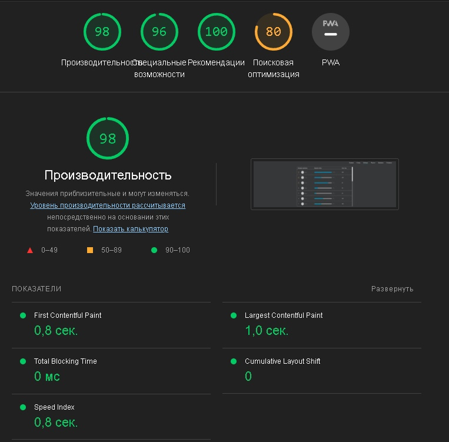
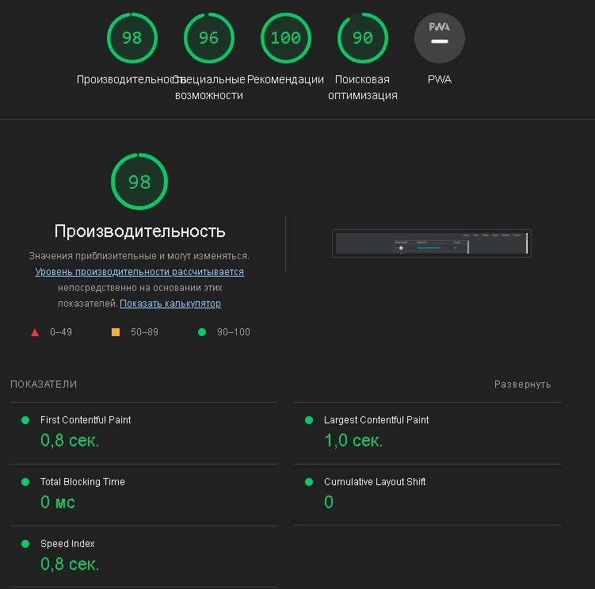

Для обнаружения использовались Chrome devtools: Perfomance, Memory, Lighthouse.

С помощью Recorder произведена запись, где сымитирован пользовательский сценарий: авторизация, переход в комнату, игра, выход из профиля.

Проанализированы полученные графики и значения памяти.

Если сделать замеры на главной странице при помощи инструмента Lighthouse в DevTools, получим следующий результат:

После замеров было произведено добавление meta-description для улучшения показателей поисковой оптимизации. 

Утечек памяти в приложении и в игре в частности не было обнаружено, проблем с показателями производительности также не обнаружено.

